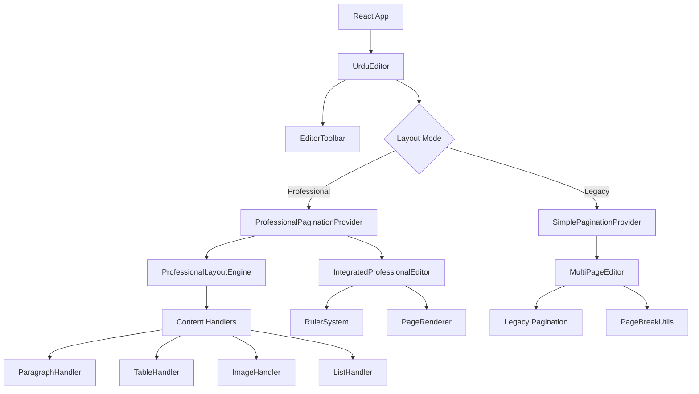
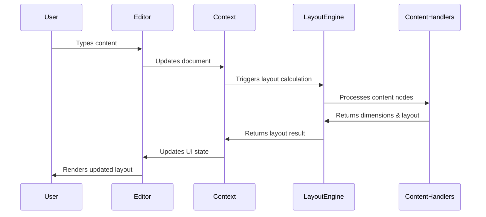
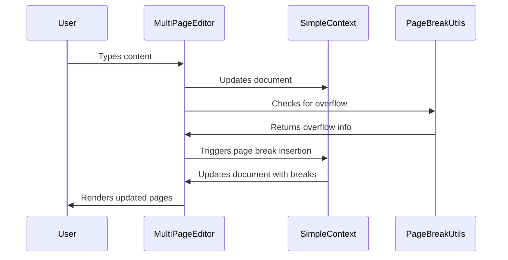
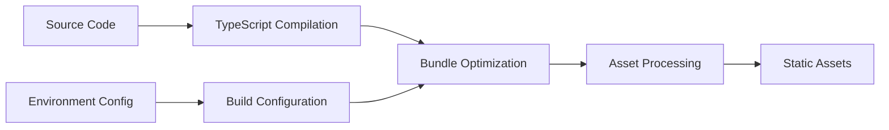

# UrDocs Architecture Documentation

## System Overview

UrDocs is built on a modern, scalable architecture that combines the power of React, TypeScript, and a custom Professional Layout Engine. The system is designed for extensibility, performance, and maintainability while providing enterprise-grade document editing capabilities.

## High-Level Architecture



## Core Components

### 1. Application Layer

#### `App.tsx`
- **Purpose**: Application root with provider hierarchy
- **Responsibilities**:
  - Provider setup (Theme, Language, HarfBuzz, Pagination)
  - Error boundary implementation
  - Global state initialization

#### `UrduEditor.tsx`
- **Purpose**: Main editor component orchestrating all features
- **Responsibilities**:
  - Layout mode switching (Professional vs Legacy)
  - Editor state management
  - Toolbar integration
  - Page setup coordination

### 2. Layout Engine Layer

#### `ProfessionalLayoutEngine` (`src/services/professionalLayoutEngine.ts`)
- **Purpose**: Core layout calculation engine
- **Key Features**:
  - Proactive layout calculation
  - Multi-content type support
  - Performance optimization
  - Extensible content handlers

```typescript
class ProfessionalLayoutEngine {
  // Core methods
  setDocument(document: DocumentNode): void
  calculateLayout(): LayoutResult
  updateConfig(config: Partial<LayoutEngineConfig>): void
  
  // Content handling
  registerContentHandler(type: string, handler: ContentHandler): void
  measureNodeHeight(node: DocumentNode, context: LayoutContext): Dimensions
  
  // Layout utilities
  createEmptyPage(index: number, dimensions: Dimensions): LayoutPage
  splitNode(node: DocumentNode, context: LayoutContext): SplitResult
}
```

#### Content Handlers
Each content type has a dedicated handler implementing the `ContentHandler` interface:

```typescript
interface ContentHandler {
  canHandle(node: DocumentNode): boolean
  calculateDimensions(node: DocumentNode, context: LayoutContext): Dimensions
  layout(node: DocumentNode, context: LayoutContext): LayoutBox[]
  split(node: DocumentNode, context: LayoutContext): SplitResult
}
```

**Available Handlers**:
- `ParagraphHandler` - Text flow and paragraph splitting
- `HeadingHandler` - Heading hierarchy and spacing
- `TableHandler` - Table layout and cell management
- `ImageHandler` - Image positioning and sizing
- `ListHandler` - List formatting and indentation
- `BlockquoteHandler` - Quote formatting
- `CodeBlockHandler` - Code syntax highlighting
- `MathHandler` - Mathematical expressions
- `ChartHandler` - Data visualization
- `EquationHandler` - Equation formatting
- `FootnoteHandler` - Footnote management
- `CommentHandler` - Annotation system

### 3. Context Layer

#### `ProfessionalPaginationContext.tsx`
- **Purpose**: React context for professional layout management
- **State Management**:
  - Document state synchronization
  - Layout calculation coordination
  - Performance optimization (debouncing)
  - Error handling and loading states

```typescript
interface ProfessionalPaginationContextType {
  // Core state
  layoutResult: LayoutResult | null
  isLoading: boolean
  error: string | null
  
  // Document management
  setDocument: (doc: DocumentNode) => void
  updateConfig: (config: Partial<LayoutEngineConfig>) => void
  
  // Navigation
  totalPages: number
  currentPage: number
  setCurrentPage: (page: number) => void
  
  // Content retrieval
  getPage: (pageIndex: number) => LayoutPage | undefined
  getPageContent: (pageIndex: number) => LayoutBox[]
  getHeaders: (pageIndex: number) => LayoutRegion[]
  getFooters: (pageIndex: number) => LayoutRegion[]
}
```

#### `SimplePaginationContext.tsx` (Legacy)
- **Purpose**: Fallback pagination system
- **Use Case**: When professional layout is disabled or encounters errors
- **Features**: Basic page break management and content overflow handling

### 4. UI Components Layer

#### `IntegratedProfessionalEditor.tsx`
- **Purpose**: Professional layout rendering with existing UI styling
- **Key Features**:
  - Seamless integration with legacy UI
  - Ruler system alignment
  - Page interaction handling
  - Fallback states (loading, error)

#### `MultiPageEditor.tsx` (Legacy)
- **Purpose**: Original multi-page editor implementation
- **Features**: Reactive pagination with overflow detection

#### `EditorToolbar.tsx` & `ToolbarContainer.tsx`
- **Purpose**: Modular toolbar system
- **Components**:
  - `DocumentControls.tsx` - Layout toggle and document operations
  - `FontControls.tsx` - Typography and font management
  - `FormattingControls.tsx` - Text formatting tools
  - `AlignmentControls.tsx` - Text alignment
  - `ZoomControls.tsx` - Zoom and scale management
  - `ExportControls.tsx` - Print and export functionality

### 5. Utility Layer

#### Layout Utilities
- `dimensionUtils.ts` - Page size calculations and conversions
- `pageBreakUtils.ts` - Legacy page break utilities
- `printUtils.ts` - Print formatting and optimization

#### Text Processing
- `urduTextProcessor.ts` - Urdu-specific text processing
- `keyboardLayouts.ts` - Keyboard layout mappings
- `useUrduKeyboard.ts` - Keyboard input handling

#### Font Management
- `fontManager.ts` - Font loading and management
- `fontNameMapping.ts` - Font name translations
- `simpleFontService.ts` - Font service implementation

#### HarfBuzz Integration
- `harfbuzzService.ts` - Text shaping service
- `browserHarfBuzz.ts` - Browser-specific HarfBuzz implementation
- `harfBuzzErrorHandler.ts` - Error handling for text shaping

## Data Flow

### Professional Layout Flow



### Legacy Layout Flow



## State Management

### Document State
```typescript
interface DocumentNode {
  type: 'doc'
  content: (ParagraphNode | HeadingNode | TableNode | ImageNode | ListNode | BlockquoteNode | CodeBlockNode | MathNode | ChartNode | EquationNode | FootnoteNode | CommentNode)[]
}
```

### Layout State
```typescript
interface LayoutResult {
  pages: LayoutPage[]
  totalPages: number
  contentHeight: number
  overflowDetected: boolean
  performanceMetrics: {
    layoutTime: number
    nodeCount: number
    pageCount: number
  }
}
```

### Configuration State
```typescript
interface LayoutEngineConfig {
  pageSize: 'A4' | 'Letter' | 'Legal' | 'Custom'
  orientation: 'portrait' | 'landscape'
  customWidth?: number
  customHeight?: number
  margins: PageMargins
  columns: ColumnConfig
  typography: TypographyConfig
  performance: PerformanceConfig
}
```

## Performance Architecture

### Optimization Strategies

#### 1. Debounced Calculations
- **Implementation**: 300ms debounce for layout calculations
- **Benefit**: Prevents excessive computation during rapid typing
- **Location**: `ProfessionalPaginationContext.tsx`

#### 2. Memoization
- **React.memo**: Prevents unnecessary component re-renders
- **useMemo**: Caches expensive calculations
- **useCallback**: Memoizes event handlers
- **Location**: Throughout UI components

#### 3. Lazy Loading
- **Content Handlers**: Loaded on demand
- **Font Resources**: Progressive font loading
- **Component Code**: Dynamic imports for heavy components

#### 4. Efficient Rendering
- **Virtual Scrolling**: For large documents (planned)
- **Incremental Updates**: Only re-render changed sections
- **Background Processing**: Layout calculations in Web Workers (planned)

### Performance Metrics

```typescript
interface PerformanceMetrics {
  layoutTime: number        // Layout calculation duration
  nodeCount: number         // Number of content nodes processed
  pageCount: number         // Number of pages generated
  memoryUsage?: number      // Memory consumption (if available)
  renderTime?: number       // UI rendering time (if available)
}
```

## Error Handling

### Error Boundaries
- **Component Level**: `ErrorBoundary.tsx` for component crashes
- **Context Level**: Error states in pagination contexts
- **Service Level**: Try-catch blocks in layout engine

### Graceful Degradation
- **Professional → Legacy**: Automatic fallback on layout errors
- **Loading States**: User feedback during calculations
- **Validation**: Input validation for configurations
- **Recovery**: Automatic retry mechanisms

### Error Types
```typescript
enum LayoutError {
  CALCULATION_FAILED = 'CALCULATION_FAILED',
  INVALID_DOCUMENT = 'INVALID_DOCUMENT',
  INVALID_CONFIG = 'INVALID_CONFIG',
  CONTENT_HANDLER_ERROR = 'CONTENT_HANDLER_ERROR',
  PERFORMANCE_WARNING = 'PERFORMANCE_WARNING'
}
```

## Extensibility

### Adding New Content Types

1. **Define Node Type**:
```typescript
interface CustomNode extends DocumentNode {
  type: 'custom'
  customProperty: string
}
```

2. **Create Content Handler**:
```typescript
class CustomHandler implements ContentHandler {
  canHandle(node: DocumentNode): boolean {
    return node.type === 'custom'
  }
  
  calculateDimensions(node: DocumentNode, context: LayoutContext): Dimensions {
    // Implementation
  }
  
  layout(node: DocumentNode, context: LayoutContext): LayoutBox[] {
    // Implementation
  }
  
  split(node: DocumentNode, context: LayoutContext): SplitResult {
    // Implementation
  }
}
```

3. **Register Handler**:
```typescript
layoutEngine.registerContentHandler('custom', new CustomHandler())
```

### Adding New Layout Features

1. **Extend Configuration**:
```typescript
interface ExtendedLayoutConfig extends LayoutEngineConfig {
  newFeature: NewFeatureConfig
}
```

2. **Update Layout Engine**:
```typescript
class ExtendedLayoutEngine extends ProfessionalLayoutEngine {
  // Add new methods
}
```

3. **Update UI Components**:
```typescript
// Add UI controls for new features
```

## Security Considerations

### Input Validation
- **Document Structure**: Validate document nodes before processing
- **Configuration**: Sanitize user-provided configurations
- **Content**: Validate content before layout calculation

### XSS Prevention
- **Content Sanitization**: Clean user input before rendering
- **Safe Rendering**: Use React's built-in XSS protection
- **Content Security Policy**: Implement CSP headers

### Performance Protection
- **Rate Limiting**: Prevent excessive layout calculations
- **Resource Limits**: Limit document size and complexity
- **Timeout Handling**: Prevent infinite calculation loops

## Testing Strategy

### Unit Tests
- **Content Handlers**: Test individual content type handling
- **Layout Engine**: Test core layout calculations
- **Utilities**: Test utility functions and helpers

### Integration Tests
- **Context Integration**: Test context state management
- **Component Integration**: Test component interactions
- **End-to-End**: Test complete user workflows

### Performance Tests
- **Layout Performance**: Measure layout calculation times
- **Memory Usage**: Monitor memory consumption
- **Rendering Performance**: Test UI rendering performance

## Deployment Architecture

### Build Process


### Static Deployment
- **GitHub Pages**: Static hosting
- **CDN**: Asset delivery optimization
- **Service Worker**: Offline capabilities (planned)

### Environment Configuration
```typescript
interface EnvironmentConfig {
  NODE_ENV: 'development' | 'production' | 'test'
  PUBLIC_URL: string
  ENABLE_DEBUG: boolean
  PERFORMANCE_MONITORING: boolean
}
```

## Monitoring and Analytics

### Performance Monitoring
- **Layout Metrics**: Track layout calculation performance
- **User Interactions**: Monitor user behavior patterns
- **Error Tracking**: Log and analyze errors

### User Analytics
- **Feature Usage**: Track which features are used most
- **Performance Impact**: Monitor performance impact of features
- **User Feedback**: Collect user satisfaction metrics

## Future Architecture Evolution

### Planned Improvements

#### 1. Micro-Frontend Architecture
- **Modular Components**: Independent deployable components
- **Shared Libraries**: Common utilities and services
- **Plugin System**: Third-party extensions

#### 2. Real-time Collaboration
- **WebSocket Integration**: Real-time document synchronization
- **Conflict Resolution**: Automatic conflict resolution algorithms
- **Presence Indicators**: User presence and cursor tracking

#### 3. Advanced Performance
- **Web Workers**: Background processing for heavy operations
- **WebAssembly**: High-performance text processing
- **Progressive Loading**: Incremental document loading

#### 4. Cloud Integration
- **Document Storage**: Cloud document persistence
- **Version Control**: Document versioning and history
- **Collaboration Features**: Team editing and sharing

---

*This architecture documentation provides a comprehensive overview of the UrDocs system. For specific implementation details, refer to the individual component documentation and source code comments.*
